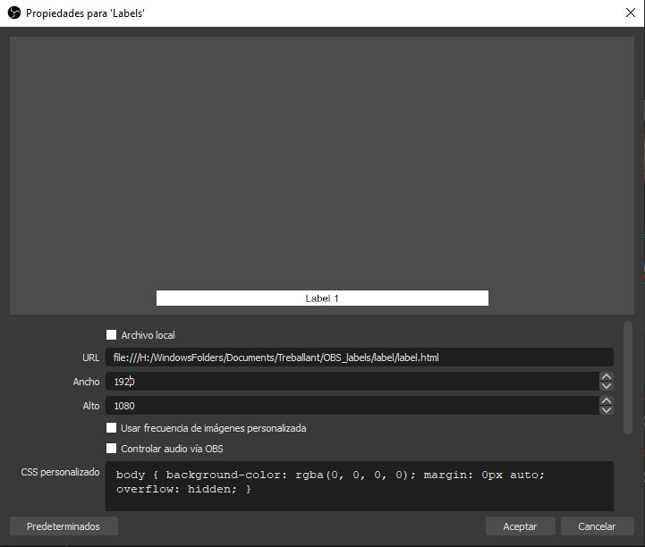
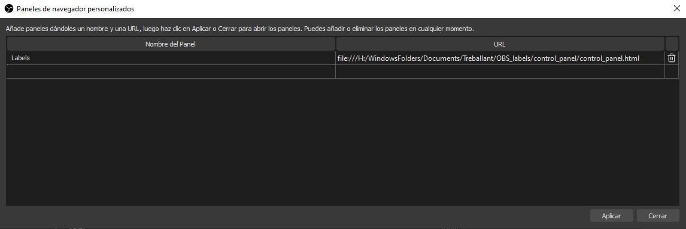
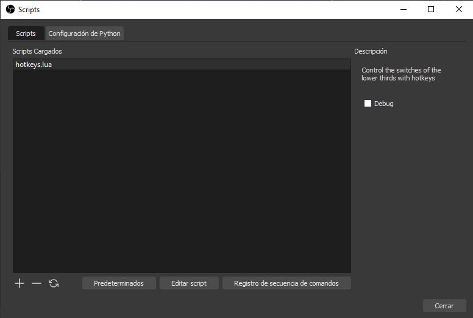
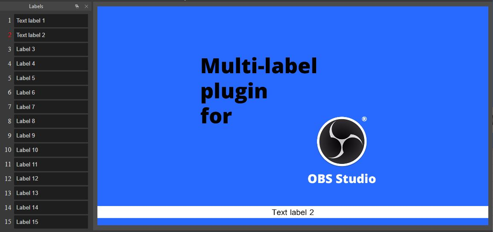

# Multiple label plugin for OBS

## Instalación
1. Descarga o clona el repositorio
2. Incluir en OBS como fuente de tipo "Navegador" el fichero label/label.html

3. En OBS, ir al menú Vista -> Paneles -> Paneles de navegación y añadir un panel con el nombre que desee y en el campo URL introducir el fichero control_panel/control_panel.html

4. (Opcional) En OBS ir al menú Herramientas -> Scripts y añadir el fichero hotkeys/hotkeys.lua

## Uso

Una vez realizada la instalación, se ha se introducir los textos deseados en las casillas de cada Rótulo y presionar sobre el número deseado para que aparezca el rótulo

## TODO:
 - Add documentation in english
